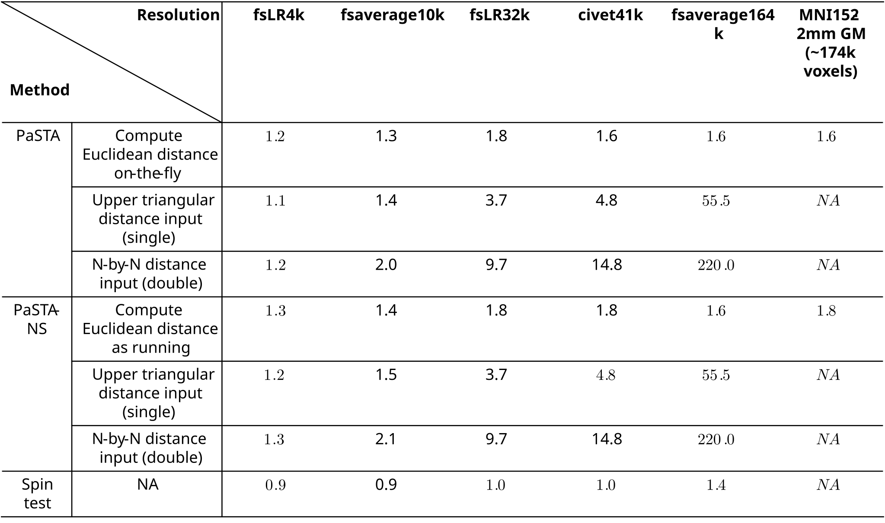
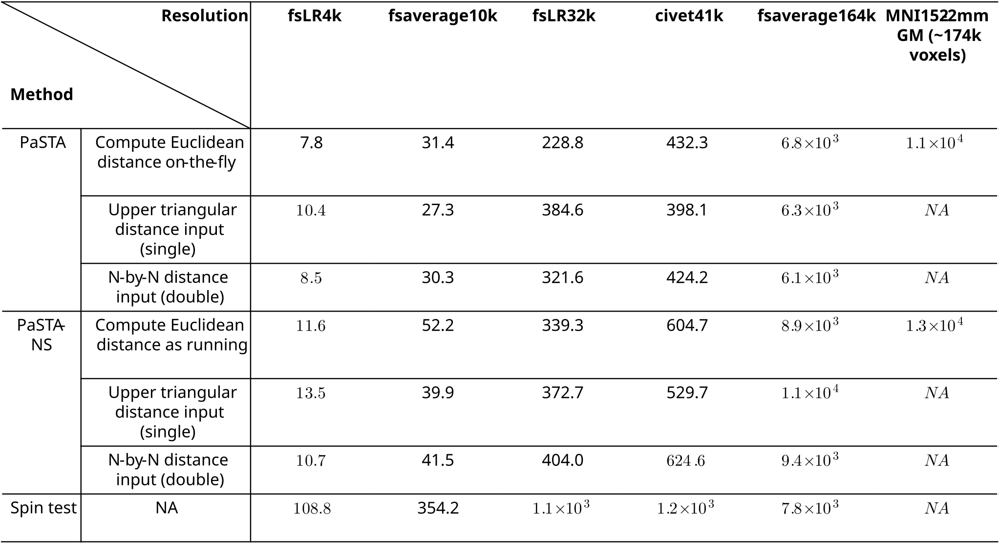

# PaSTA — Parametric Spatial Test for Associations 

**PaSTA (Parametric Spatial Test for Associations)** presents an analytical approach that infers the statistical significance of spatial association tests between spatial maps by estimating the **effective degrees of freedom** of the data.

---

## Before your start

Runtime and memory of the algorithm have been optimized for the MATLAB version, but not the Python version. This means the Python version can be much slower and requires large memory, particularly on dense maps. 

In addition, a bug in Python version of PaSTA-NS remain unfixed. Avoid using Python version of PaSTA-NS before further updates.

We are now improving and fixing the Python version and will update soon.
 
---

## Memory and runtime benchmark

PaSTA estimates the covariance structure of data and has an $O(N^2)$ computational complexity in time and memory, where $N$ is the number of data points. 

**Memory**

Although memory can be a major concern when evaluating dense spatial maps, PaSTA optimized the memory use by processing square matrices in a blockwise manner (default block size 2,000) and avoided forming the memory-hard N-by-N matrices. 

- By default, PaSTA computes Euclidean distance between data on-the-fly from their spatial coordinates to minimize memory burden, enabling autocorrelation correction on dense maps (e.g., fsaverage164k and MNI152 2mm GM voxels) with less than $2GB$ memory when the default block size of 2,000 is used. 

- When a non-Euclidean (e.g., geodesic) distance metric is provided by the user, PaSTA will need more memory to store the distance input. The memory needed in practice depends on the format and precision of distance inputs, and the number of observations $N$. A typical modern personal laptop should be sufficient to evaluate moderately dense maps (e.g., civet41k and fsLR32k) with less than $6GB$ memory when using the default block size 2,000. Denser maps such as fsaverage164k may require workstation or cluster computing with more than $50GB$ memory.

Table below displays memory needed to run PaSTA and PaSTA-NS when compute Euclidean distance on-the-fly, using an input upper triangular distance vector in single precision, and using an input full N-by-N distance matrix in double precision. The latter two represents the minimum and maximum memory requirement when a non-Euclidean distance metric is used. PaSTA and PaSTA-NS used the default block size of 2,000 and are compared to spin test.

**Memory (GB) needed compared to spin test (1,000 surrogates)**




**Time**

Despite the time complexity, PaSTA is typically faster than existing permutation methods that generate thousands of surrogates. 

Using a **single core Intel(R) Xeon(R) Gold 6448H CPU**, PaSTA evaluates **fsaverage10k brain mesh in 30 seconds**, **fsLR32k in 5 minutes**, **fsaverage164k in 2 hours**, and **MNI152-2mm GM voxels in 3 hrs**.

PaSTA-NS evaluates **fsaverage10k brain mesh in 50 seconds**, **fsLR32k in 7 minutess**, **fsaverage164k in 3 hours**, and **MNI152-2mm GM voxels in 3.5 hours**.

Table below displays runtime of PaSTA and PaSTA-NS (using the default 2,000 block size), compared to spin test with 1,000 surrogates. 
Gain in computational time is evident for sparse and moderately dense maps (fsLR4k to civet41k). The runtime of PaSTA / PaSTA-NS becomes comparable to spin test (1,000 surrogates) at fsaverage164k, but an improvement is expected when more surrogates are needed in permutation methods (e.g. 5,000 and more).

**Time (seconds) needed compared to spin test (1,000 surrogates)**


* Spin test implementation from [Spin test GitHub](https://github.com/spin-test/spin-test)
* Runtime evaluated using a single core Intel(R) Xeon(R) Gold 6448H with MATLAB 2023a

---

## Installation

We provide both MATLAB and Python implementations of PaSTA.

### MATLAB

Download the `matlab_PaSTA` folder from the present repository and add it to your MATLAB path:

```matlab
addpath(genpath('matlab_PaSTA'))
```

### Python

The Python implementation is distributed via PyPI.  
You may also clone and install manually from the present repository.

> **Note**  
> The package is distributed on PyPI under the name **`brain-pasta`**,  
> but imported in Python as **`pasta`** after installation.


#### PyPI installation

```bash
pip install brain-pasta
```

#### Import in Python

```python
import pasta
```

---

## Example usage

To evaluate the association between spatial maps *x* and *y* given:

- spatial map ***x***, may contain NaN or Inf values.
- spatial map ***y***, may contain NaN or Inf values.
- spatial coordinates ***coord*** of observations

### PaSTA (stationary assumption)

#### MATLAB

```matlab
% take 15s to run (Apple Silicon M1 Pro) on fsaverage5 10k cortical map
% pasta_fit fields:
%   pef - significance p-value
%   rX - Pearson correlation coefficient
%   nef - effective sample size
pasta_fit = pasta(x, y, coord); %Euclidean distance
pasta_fit = pasta(x, y, coord, 'D', D); %input distance D in shape (N,N)
pasta_fit = pasta(x, y, coord, 'D', D_triu); %input distance D_triu = single(D(triu(true(N), 1)));
```

#### Python

```python
# take ~3.5 min to run (Apple Silicon M1 Pro) on fsaverage5 10k cortical map, slower than MATLAB because algorithm optimization remains in development
# pef - significance p-value
# rX - Pearson correlation coefficient
# nef - effective sample size

import pasta
pef, rX, nef, run_status, n_parc, p_naive, fc_para1, fc_para2 = pasta.effective_sample_size_estimation(x, y, coord)
```

### PaSTA-NS (nonstationary assumption)

#### MATLAB

```matlab
% PaSTA-NS with data-driven parcellation
% take 20s to run (Apple Silicon M1 Pro) on fsaverage5 10k cortical map
% to control random seed, use 'random_state' argument and set to non-negative int
% pasta_fit fields:
%   pef - significance p-value
%   rX - Pearson correlation coefficient
%   nef - effective sample size
%   n_parc - number of data-driven parcellations for each map
pasta_fit = pasta(x, y, coord, 'xparc', 'auto', 'yparc', 'auto'); %Euclidean distance
pasta_fit = pasta(x, y, coord, 'D', D, 'xparc', 'auto', 'yparc', 'auto'); %input distance D in shape (N,N)
pasta_fit = pasta(x, y, coord, 'D', D_triu, 'xparc', 'auto', 'yparc', 'auto'); %input distance D_triu = single(D(triu(true(N), 1)));
```

#### Python

```python
# PaSTA-NS with data-driven parcellation
# take ~3.5 min to run (Apple Silicon M1 Pro) on fsaverage5 10k cortical map

import pasta
pef, rX, nef, run_status, n_parc, p_naive, fc_para1, fc_para2 = pasta.effective_sample_size_estimation(x, y, coord,xparc='auto',yparc='auto')
```

---

## Documentation

For full documentation and additional examples, see
[PaSTA documentation](https://brainpasta.readthedocs.io/en/latest/)
